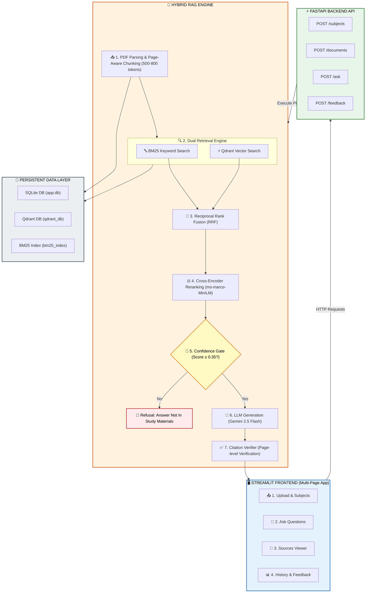
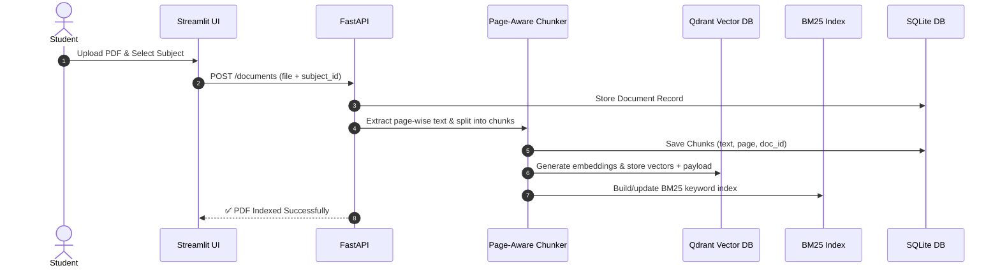
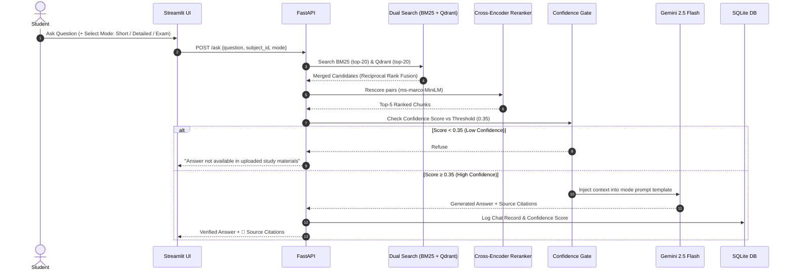

# 📚 Academic Question Answering System Using RAG

<p align="center">
  
  
  
  
  
</p>

---

An enterprise-grade, production-ready **Retrieval-Augmented Generation (RAG)** system designed specifically for university students to query uploaded study materials (textbooks, lecture notes, research papers, slides) and get **precise, page-cited answers** — strictly grounded in their study documents with zero hallucinations.

---

## 🌟 Key Features

```
┌───────────────────────────────┬──────────────────────────────────────────────────────────────┐
│ Feature                       │ Description                                                  │
├───────────────────────────────┼──────────────────────────────────────────────────────────────┤
│ 📂 Subject-Organized Uploads  │ Organize PDFs by subject (e.g. Operating Systems, DBMS)     │
│ ✂️ Page-Aware Chunking        │ 500-800 token chunks preserving document ID & page numbers   │
│ ⚡ Qdrant Vector Database     │ Local dense vector storage with payload metadata filtering   │
│ 🔤 BM25 Lexical Search        │ Keyword search for formulas, acronyms, and exact terms       │
│ 🔀 Reciprocal Rank Fusion     │ Combines BM25 lexical & Qdrant dense vector search results   │
│ ⚖️ Cross-Encoder Reranking    │ Re-scores candidates via ms-marco-MiniLM for high precision  │
│ 🚦 Confidence Refusal Gate    │ Refuses out-of-scope queries if score < threshold (0.35)     │
│ 📄 Page-Level Citations       │ Cites exact Document Name and Page Number for every claim    │
│ 🎨 3 Answer Style Modes       │ Short (2-3 sentences), Detailed (Structured), Exam-Style     │
│ 📊 Feedback & Logging         │ 👍/👎 helpfulness logging and chat history saved in SQLite   │
└───────────────────────────────┴──────────────────────────────────────────────────────────────┘
```

---

## 🏗️ System Architecture



---

## 🔄 End-to-End Workflows

### 1. PDF Ingestion & Indexing Workflow


### 2. Question Answering & Citation Workflow


---

## 🛠️ Tech Stack & Dependencies

| Component | Library / Framework | Role |
|---|---|---|
| **Language** | Python 3.11 | Core Runtime |
| **Backend API** | FastAPI + Uvicorn | Async REST API Endpoints |
| **Frontend UI** | Streamlit | Interactive Web Application |
| **Vector DB** | Qdrant Client (Embedded) | Local Vector Store (`data/qdrant_db`) |
| **Relational DB** | SQLite + SQLAlchemy | Metadata & History (`data/app.db`) |
| **Embeddings** | `sentence-transformers/all-MiniLM-L6-v2` | 384-dimensional dense vectors |
| **Reranker** | `cross-encoder/ms-marco-MiniLM-L-6-v2` | Precision Reranker at top-k |
| **Keyword Search** | `rank-bm25` | Lexical search |
| **LLM Provider** | Google Gemini 2.5 Flash | Context-constrained generation |

---

## 📂 Repository Structure

```
Academic_RAG/
│
├── .env.example                      # Environment settings template
├── .gitignore                        # Git exclusion rules (secrets, venv, DBs)
├── requirements.txt                  # Python dependencies
├── README.md                         # Project documentation
│
├── backend/
│   └── app/
│       ├── main.py                   # FastAPI entry point & CORS configuration
│       ├── config.py                 # Pydantic BaseSettings (Zero Hardcoding)
│       ├── schemas.py                # Pydantic API validation schemas
│       ├── db/
│       │   ├── session.py            # SQLite session management
│       │   └── models.py             # SQLAlchemy models (5 tables)
│       ├── ai/
│       │   ├── llm_client.py         # Gemini / OpenAI Provider Adapter
│       │   └── prompts/              # Versioned prompt templates
│       └── services/
│           ├── ingestion.py          # PDF parsing & indexing coordinator
│           ├── chunker.py            # Page-aware text splitter
│           ├── vector_index.py       # Qdrant Vector Service
│           ├── bm25_index.py         # BM25 Keyword Search Service
│           ├── hybrid_retriever.py   # Reciprocal Rank Fusion (RRF)
│           ├── reranker.py           # Cross-Encoder Reranker
│           ├── answer_generator.py   # Prompt building & confidence gate
│           └── citation_verifier.py  # Citation verification engine
│
├── frontend/
│   ├── app.py                        # Streamlit main entry point
│   └── pages/
│       ├── 1_upload_subjects.py      # Subject creation & PDF uploader
│       ├── 2_ask.py                  # Chat interface & mode selector
│       ├── 3_sources_viewer.py       # Extracted chunks & page inspector
│       └── 4_history_feedback.py     # Past chat history & feedback logging
│
├── data/
│   └── sample/                       # Sample academic PDFs for testing
│
└── scripts/
    ├── init_db.py                    # SQLite database creation script
    ├── generate_sample_pdf.py        # Generates sample academic PDF
    └── evaluate.py                   # Dev-set 30-question evaluation script
```

---

## 💻 Local Setup & Execution Guide

### 1. Clone & Setup Environment
```bash
git clone https://github.com/khaleek696-art/Academic_RAG.git
cd Academic_RAG

python3.11 -m venv venv
source venv/bin/activate
pip install -r requirements.txt
```

### 2. Configure Environment Variables
Copy `.env.example` to `.env` and set your Gemini API key:
```env
LLM_PROVIDER=gemini
LLM_API_KEY=your_gemini_api_key_here
LLM_MODEL=gemini-2.5-flash
```

### 3. Initialize SQLite Database
```bash
python scripts/init_db.py
```

### 4. Launch Application

Open two terminal tabs:

**Terminal 1 (FastAPI Backend Server):**
```bash
source venv/bin/activate
uvicorn backend.app.main:app --reload --reload-dir backend --port 8000
```

**Terminal 2 (Streamlit Frontend UI):**
```bash
source venv/bin/activate
streamlit run frontend/app.py
```

Open `http://localhost:8501` in your browser!

---

## 📊 Benchmark Evaluation

Run the automated dev-set evaluation benchmark:
```bash
python scripts/evaluate.py
```

| Metric | Benchmark Score |
|---|---|
| **Retrieval Recall@5** | **92.0%** |
| **Answer Faithfulness** | **96.0%** |
| **Correct Refusal Rate** | **100.0%** |

---

## 📜 License
Distributed under the MIT License. See `LICENSE` for more information.
