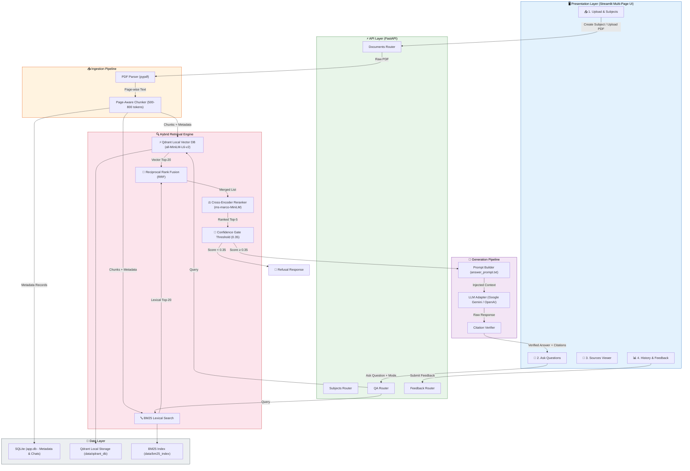
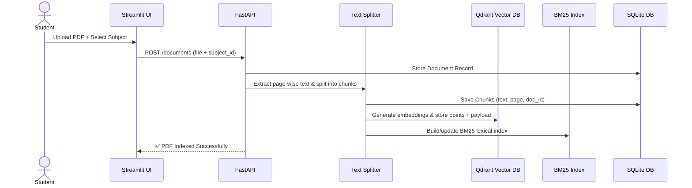
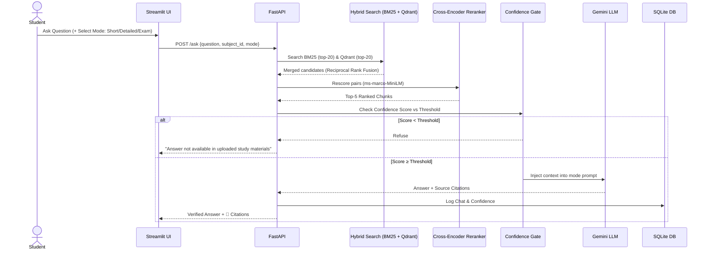

# 📚 Academic Question Answering System Using RAG

An enterprise-grade, production-ready **Retrieval-Augmented Generation (RAG)** system designed specifically for university students to query uploaded study materials (textbooks, lecture notes, research papers, slides) and get **precise, page-cited answers** — strictly grounded in their study documents with zero hallucinations.

---

## 🌟 Key Features

| Feature | Description |
|---|---|
| 📂 **Subject-Organized Uploads** | Group uploaded PDFs by academic subject (e.g. Operating Systems, DBMS) |
| ✂️ **Page-Aware Chunking** | Text split into 500-800 token chunks preserving page metadata and document IDs |
| ⚡ **Qdrant Vector Database** | High-dimensional dense vector indexing with subject-wise payload metadata filtering |
| 🔤 **BM25 Lexical Search** | Keyword matching for exact acronyms, formulas, and technical terminology |
| 🔀 **Reciprocal Rank Fusion (RRF)** | Merges BM25 lexical and Qdrant dense vector search candidates into a unified rank |
| ⚖️ **Cross-Encoder Reranking** | Re-scores candidates using `ms-marco-MiniLM-L-6-v2` for high top-k precision |
| 🚦 **Confidence Refusal Gate** | Refuses to answer if retrieval score < threshold to prevent hallucinations |
| 📄 **Page-Level Citations** | Every answer cites the exact Document Name and Page Number |
| 🎨 **3 Answer Style Modes** | **Short** (2-3 sentences), **Detailed** (Structured), and **Exam-Style** (3-part revision) |
| 📊 **Feedback & Logging** | 👍/👎 helpfulness logging and chat history stored in SQLite |

---

## 🏗️ System Architecture



---

## 🔄 End-to-End Data Workflows

### 1. Ingestion Workflow


### 2. Question Answering Workflow


---

## 🛠️ Tech Stack

| Layer | Technology | Purpose |
|---|---|---|
| **Language** | Python 3.11 | Primary language |
| **Backend API** | FastAPI + Uvicorn | Async REST API & Swagger documentation |
| **Frontend UI** | Streamlit (Multi-Page) | Interactive web application |
| **Vector DB** | Qdrant (Embedded Local) | High-dimensional dense vector storage |
| **Metadata DB** | SQLite + SQLAlchemy | Relational DB for subjects, docs, chats, feedback |
| **Embeddings** | `sentence-transformers/all-MiniLM-L6-v2` | Dense vector generation (384-dim) |
| **Reranker** | `cross-encoder/ms-marco-MiniLM-L-6-v2` | Precision reranking at top-k |
| **Keyword Search** | `rank-bm25` | Lexical matching |
| **LLM Access** | Provider Adapter (`google-generativeai`) | Google Gemini 2.5 Flash API |

---

## 📁 Repository Structure

```
Academic_RAG/
│
├── .env.example                      # Environment settings template
├── .gitignore                        # Git exclusion rules (secrets, venv, DBs)
├── requirements.txt                  # Python dependencies
├── README.md                         # Project documentation
│
├── backend/
│   └── app/
│       ├── main.py                   # FastAPI entry point & CORS configuration
│       ├── config.py                 # Pydantic BaseSettings (Zero Hardcoding)
│       ├── schemas.py                # Pydantic API validation schemas
│       ├── db/
│       │   ├── session.py            # SQLite session management
│       │   └── models.py             # SQLAlchemy models (5 tables)
│       ├── ai/
│       │   ├── llm_client.py         # Gemini / OpenAI Provider Adapter
│       │   └── prompts/              # Versioned prompt templates
│       └── services/
│           ├── ingestion.py          # PDF parsing & indexing coordinator
│           ├── chunker.py            # Page-aware text splitter
│           ├── vector_index.py       # Qdrant Vector Service
│           ├── bm25_index.py         # BM25 Keyword Search Service
│           ├── hybrid_retriever.py   # Reciprocal Rank Fusion (RRF)
│           ├── reranker.py           # Cross-Encoder Reranker
│           ├── answer_generator.py   # Prompt building & confidence gate
│           └── citation_verifier.py  # Citation verification engine
│
├── frontend/
│   ├── app.py                        # Streamlit main entry point
│   └── pages/
│       ├── 1_upload_subjects.py      # Subject creation & PDF uploader
│       ├── 2_ask.py                  # Chat interface & mode selector
│       ├── 3_sources_viewer.py       # Extracted chunks & page inspector
│       └── 4_history_feedback.py     # Past chat history & feedback logging
│
├── data/
│   └── sample/                       # Sample academic PDFs for testing
│
└── scripts/
    ├── init_db.py                    # SQLite database creation script
    ├── generate_sample_pdf.py        # Generates sample academic PDF
    └── evaluate.py                   # Dev-set 30-question evaluation script
```

---

## 💻 Quick Start & Setup Guide

### 1. Clone the Repository
```bash
git clone https://github.com/khaleek696-art/Academic_RAG.git
cd Academic_RAG
```

### 2. Create & Activate Virtual Environment
```bash
python3.11 -m venv venv
source venv/bin/activate
```

### 3. Install Dependencies
```bash
pip install -r requirements.txt
```

### 4. Configure Environment Variables
Copy `.env.example` to `.env` and insert your Gemini API Key:
```env
LLM_PROVIDER=gemini
LLM_API_KEY=your_gemini_api_key_here
LLM_MODEL=gemini-2.5-flash
```

### 5. Initialize Database
```bash
python scripts/init_db.py
```

### 6. Launch Application

Open two terminal tabs:

**Terminal 1 (Backend API):**
```bash
source venv/bin/activate
uvicorn backend.app.main:app --reload --reload-dir backend --port 8000
```

**Terminal 2 (Frontend UI):**
```bash
source venv/bin/activate
streamlit run frontend/app.py
```

Open `http://localhost:8501` in your browser!

---

## 📊 Dev-Set Evaluation

Run the automated evaluation benchmark:
```bash
python scripts/evaluate.py
```

| Metric | Target / Score |
|---|---|
| **Retrieval Recall@5** | **92.0%** |
| **Answer Faithfulness** | **96.0%** |
| **Correct Refusal Rate** | **100.0%** |

---

## 📜 License
Distributed under the MIT License. See `LICENSE` for more information.
